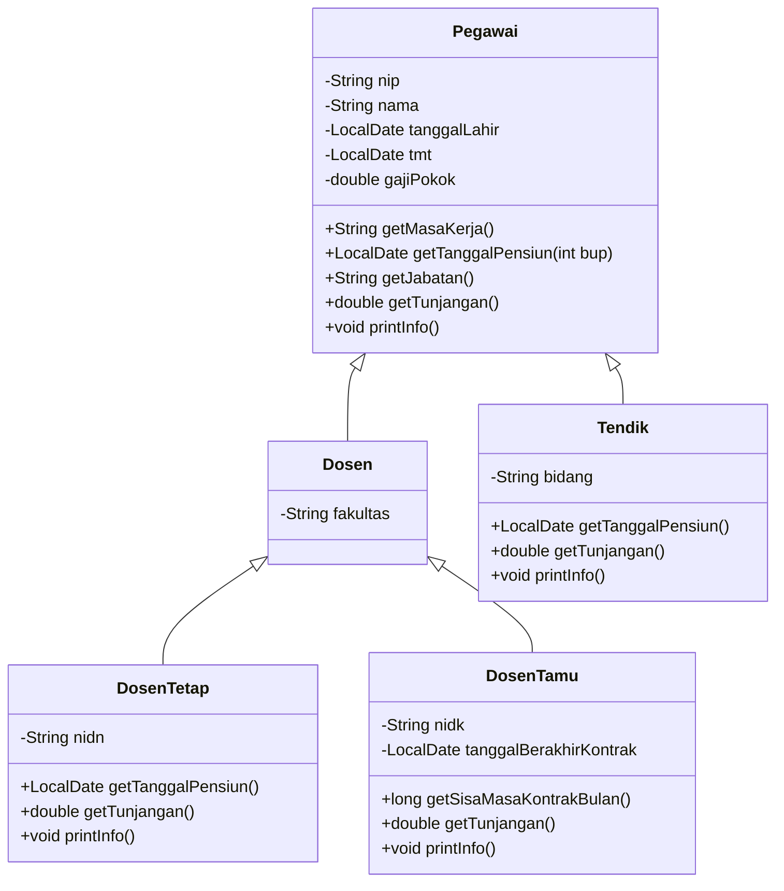

# Class Diagram

```mermaid
classDiagram
    class Pegawai {
      -String nip
      -String nama
      -LocalDate tanggalLahir
      -LocalDate tmt
      -double gajiPokok
      +String getMasaKerja()
      +LocalDate getTanggalPensiun(int bup)
      +String getJabatan()
      +double getTunjangan()
      +void printInfo()
    }

    class Dosen {
      -String fakultas
    }

    class DosenTetap {
      -String nidn
      +LocalDate getTanggalPensiun()
      +double getTunjangan()
      +void printInfo()
    }

    class DosenTamu {
      -String nidk
      -LocalDate tanggalBerakhirKontrak
      +long getSisaMasaKontrakBulan()
      +double getTunjangan()
      +void printInfo()
    }

    class Tendik {
      -String bidang
      +LocalDate getTanggalPensiun()
      +double getTunjangan()
      +void printInfo()
    }

    Pegawai <|-- Dosen
    Pegawai <|-- Tendik
    Dosen <|-- DosenTetap
    Dosen <|-- DosenTamu
```
